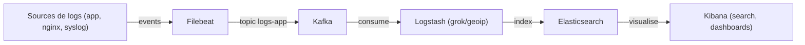

# TP Stack ELKK (Elasticsearch, Logstash, Kibana, Kafka, Filebeat)

## Objectifs pédagogiques

- Comprendre le rôle de chaque brique (collecte, transport, ingestion, recherche/visualisation).
- Déployer rapidement une stack ELKK et valider le flux de bout en bout.
- Savoir enrichir, parser et router des logs avec Logstash.
- Produire et consommer des messages Kafka pour absorber la charge.
- Construire des recherches, dashboards et alertes basiques dans Elasticsearch/Kibana.

## Pré-requis

- Docker/Docker Compose installés.
- `curl`, `jq` et un éditeur de texte.
- 2 vCPU, 4–6 Go RAM minimum.

## Plan du TP (3h)

1. **Mise en place** (20 min)
   - Cloner le repo, lancer `docker compose up` avec Elasticsearch, Kibana, Kafka/ZooKeeper, Logstash, Filebeat.
   - Sanity check: health Elasticsearch, topic Kafka créé, Kibana accessible.
2. **Flux de logs vers Kafka** (30 min)
   - Configurer Filebeat pour lire des logs applicatifs (ex: container Nginx ou fichier simulé).
   - Envoyer les événements sur un topic Kafka dédié.
3. **Ingestion et enrichissement Logstash** (45 min)
   - Pipeline Logstash: input Kafka → filtres (grok/JSON, geoip, rename) → output Elasticsearch.
   - Vérifier l’indexation (`_cat/indices/app-logs-*`, `GET app-logs-*/_search`).
4. **Exploration dans Kibana** (30 min)
   - Créer un index pattern, valider les champs, premières recherches KQL.
   - Construire un dashboard simple (compte d’erreurs, top URLs, carte si geoip).
5. **Résilience et scale** (25 min)
   - Tester un pic de messages (`kafkacat`/`kcat` ou script producer).
   - Observer la persistance dans Kafka quand Logstash est arrêté, puis reprise.
   - Ajuster `pipeline.workers`/`batch.size`, partitions Kafka, et comparer.
6. **Alerting et export** (20 min)
   - Créer une règle d’alerte (threshold sur erreurs) ou export vers Slack/Webhook simulé.
   - Option bonus: sauvegarder une requête avec Watcher/Rule et déclencher manuellement.
7. **Synthèse** (10 min)
   - Points forts/faiblesses de la stack.
   - Idées d’industrialisation (ILM, Fleet/Elastic Agent, monitoring).

## Schéma d’architecture



## Déroulé détaillé

- **01 | Bootstrap du lab**

  - Copier un `docker-compose.yml` fournissant: `elasticsearch`, `kibana`, `logstash`, `filebeat`, `kafka`, `zookeeper`.
  - Monter un volume pour les logs d’exemple (`./samples/logs/app.log`).

- **02 | Filebeat → Kafka**

  - Configurer `filebeat.inputs` en `log` ou `container`.
  - Sortie `kafka` avec `acks=all`, partitionnement par `hostname`.
  - Valider avec `kafka-console-consumer` ou `kcat`.

- **03 | Kafka → Logstash → Elasticsearch**

  - Input `kafka` sur le topic `logs-app`.
  - Filtres: `json` (si log JSON), `grok` (si texte), `mutate` pour normaliser les champs, `geoip` si IP source.
  - Output `elasticsearch` vers l’index `app-logs-%{+YYYY.MM.dd}`.
  - Vérifier l’index: `curl -s localhost:9200/_cat/indices/app-logs-*?v`.
  - Ajouter un filtre grok pour extraire l'url du message
    <details>
      <summary>Spoiler warning</summary>
      
    ```logstash
    if [message] {
        grok {
          match => { "[parsed][message]" => "%{WORD:[http][method]} %{URIPATHPARAM:[url][path]}" }
          tag_on_failure => ["grok_message_no_url"]
        }
      }
    ```    
    </details>

- **04 | Kibana**

  - Créer un Data View `app-logs-*`.
  - Requêtes KQL: `status >= 500`, `url : "/api/*"`, histogramme par 1m.
  - Dashboard minimal: `count`, `top 5 URLs`, `top hosts`, `geo map` (si geoip).

- **05 | Test de charge et résilience**

  - Générer 10k–100k messages avec un script producer ou `kcat -P`.
  - Stopper Logstash pour observer le buffering Kafka, puis relancer.
  - Surveiller la latence et la taille du backlog.
    <details>
      <summary>Spoiler warning</summary>
      
      ```bash
      # Générer rapidement des messages (ici 1000 lignes)
      seq 1 1000 | docker compose exec -T kafka kafka-console-producer --bootstrap-server kafka:9092 --topic logs-app

    # Voir le backlog et le lag du consumer Logstash

    docker compose exec kafka kafka-consumer-groups --bootstrap-server kafka:9092 --group logstash --describe

    # Tester la résilience: arrêter puis relancer Logstash

    docker compose stop logstash

    # ...laisser Filebeat pousser, puis...

    docker compose start logstash

    ```
    </details>
    ```

- **06 | Alerting / intégrations**

  - Règle Kibana sur `status >= 500` avec action webhook (ou log).
  - Option: exporter les logs vers un second index ou S3-like (simulé).
    <details>
      <summary>Spoiler warning</summary>
      
      ```bash
      # Requête pour l’alerte (Discover / Dev Tools)
      status >= 500 and url.path : "/api/*"

    # Simuler un webhook local (listener netcat)

    nc -l 0.0.0.0 9999 &

    # Dans Kibana, configurer l'action webhook vers http://host.docker.internal:9999

    ```
    </details>
    ```

- **07 | Nettoyage**

  - `docker compose down -v`.
  - Échanger sur les améliorations (ILM, Fleet, APM, security).
    <details>
      <summary>Spoiler warning</summary>
      
      ```bash
      # Arrêt et nettoyage complet
      docker compose down -v

    # (Option) purge des indices applicatifs

    curl -XDELETE localhost:9200/app-logs-\*

    ```
    </details>
    ```

## Livrables attendus

- Un `docker-compose.yml` prêt à l’emploi.
- Configs `logstash.conf` et `filebeat.yml` utilisables.
- Un petit jeu de logs d’exemple.
- Un dashboard Kibana sauvegardé ou des captures.
- Un court compte-rendu des observations (débit, erreurs, latence).

## Notes pédagogiques

- Rappeler la différence Beats vs Elastic Agent (Fleet) et quand préférer l’un ou l’autre.
  <details>
    <summary>Spoiler warning</summary>
    
    - Beats = agents mono-usage (Filebeat, Metricbeat...), config locale.  
    - Elastic Agent = agent unique, géré par Fleet, policies centralisées, meilleures features (intégrations, sécurité).  
    - Préférer Elastic Agent/Fleet dès qu’on a un socle centralisé et besoin de gouvernance; garder Beats pour des déploiements légers/isolés.
    </details>

- Insister sur Kafka comme tampon/régulateur et sur les stratégies de reprise.

- Mentionner ILM (hot/warm/delete) pour maîtriser les coûts.
  <details>
    <summary>Spoiler warning</summary>
    
    - Créer des policies ILM: hot (ingest), warm (stockage moins cher), delete (TTL).  
    - Ajuster la durée de rétention selon les besoins métiers/compliance.  
    - Réduire `number_of_replicas` sur les indices de test/lab; privilégier des shards modestes (1-2).  
    - Surveiller la taille des indices et les ouvertures de shards.
    </details>

- Mettre en garde sur le mapping dynamique et les champs non contrôlés.
  <details>
    <summary>Spoiler warning</summary>
    
    - Le mapping dynamique peut créer une explosion de champs (`fields explosion`) et des collisions de types.  
    - Définir un template explicite pour les champs critiques (types, formats de date, IP).  
    - Limiter ou désactiver le `dynamic` pour les sous-objets non maîtrisés; utiliser `ignore_malformed` au besoin.  
    </details>

- Surveiller la sécurité: auth, TLS, filtrage réseau, masquage de données sensibles.
  <details>
    <summary>Spoiler warning</summary>
    
    - Activer TLS et authentification sur ES/Kibana et durcir les ACL réseau.  
    - Masquer/redacter les données sensibles via Logstash (`mutate`, `gsub`, `anonymize`) ou Filebeat processors (drop/rename).  
    - Masquer les champs secrets dans Kibana (data view de type `obscured` ou filtrage) et limiter les rôles RBAC.  
    </details>

## Commandes de vérification rapide

- Stack up: `docker compose ps`
- Santé ES: `curl -s localhost:9200/_cluster/health?pretty`
- Indices: `curl -s localhost:9200/_cat/indices/app-logs-*?v`
- Topics Kafka: `docker compose exec kafka kafka-topics --bootstrap-server kafka:9092 --list`
- Événements Kafka (tail): `docker compose exec kafka kafka-console-consumer --bootstrap-server kafka:9092 --topic logs-app --from-beginning --max-messages 5 --timeout-ms 5000`
- Logs Filebeat: `docker compose logs filebeat --tail=20`
- Logs Logstash: `docker compose logs logstash --tail=20`
- Kibana ready (HTTP 302/200): `curl -I localhost:5601`
- Ajouter une nouvelle ligne de log (déclenche Filebeat) : `echo '{"@timestamp":"'$(date -u +"%Y-%m-%dT%H:%M:%SZ")'","message":"GET /demo","status":200,"client_ip":"1.1.1.1","service":"web"}' >> samples/logs/app.log`

```

```
